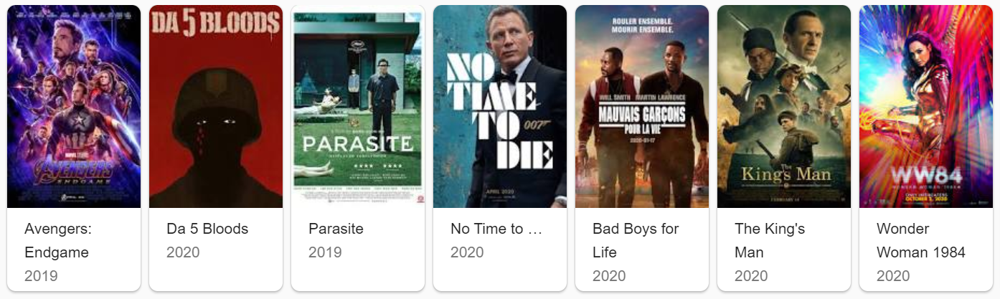

# Streamlit-based Netflix Recommender System
#### By Anda Mchako



In today’s technology driven world, recommender systems are socially and economically critical for ensuring that individuals can make appropriate choices surrounding the content they engage with on a daily basis. 

One application where this is especially true surrounds movie content recommendations; where intelligent algorithms can help viewers find great titles from tens of thousands of options

## Getting Started

Clone the repository
```
https://github.com/andamchako/Netflix-Recommender
```

### Prerequisites

The following packages need to be installed:

```
pip install -U streamlit numpy pandas scikit-learn
pip install -U nltk
```

### Installing

The main product is a streamlit app.

To run the app locally:

```
cd Netflix-Recommender/
streamlit run app.py
```
The app contains 3 main pages:
1. Recommender System
2. Solution Overview
3. Meet the Author

## Running the tests

- Go to the Recommender System page
- choose a movie/series from each dropdown
- click the recommend button

### Break down into recommender output

The output will be the top ten movies recommended.

The output from the content based model is based on
- plot descriptions

## Deployment

Coming soon

## Built With

* [EXPLORE](https://github.com/Explore-AI/unsupervised-predict-streamlit-template) - The template we used
* [Streamlit](https://www.streamlit.io/)- App framework 

## Authors

* **ANDA MCHAKO** - [andamchako](https://https://github.com/andamchako)


## Acknowledgments

* **MONICA FARRELL** - [monicafar147](https://github.com/monicafar147)
* **ZINTLE FALTEIN-MAQUBELA** - [ZintleFaltein](https://github.com/ZintleFaltein)
* KDNuggets
* Towards data science blog posts
* Medium blog posts
* Explore Data Science Academy - [EXPLORE](https://github.com/Explore-AI)

